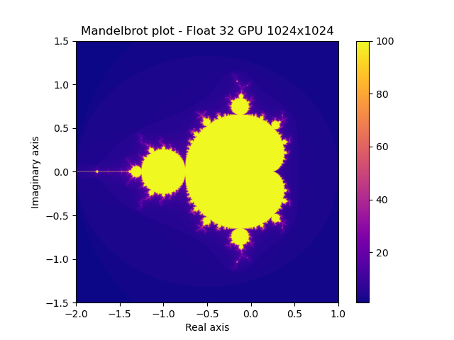

# Numerical Scientific Computing

In this repository you will find different implementations of computing the Mandelbrot set.

This repository contains the following implementations:

- Naive - Pure Python version
- Numpy - Vectorized CPU version
- Numba - JIT compiler version
- Multiprocessing - Parallel CPU execution accessing physical cores
- Local Dask - Distributed task based parallelism
- GPU - OpenCL based GPU version

### Development environment

All the material in this repository is based on Python and Miniforge. Miniforge has been used as an installer for Mamba to target conda-forge packages rather than pip packages.

**Loading Environment settings**

The applied environment has been exported into an environment.yml file to make reproducing the environment easier.

Create environment and load from environment.yml:

```sh
mamba env create -f environment.yml
```

Activate environment:

```sh
conda activate nsc2026
```

### Trying out Mandelbrot implementations

You can find the source code in the **all_mandelbrot_implementations** folder. The mandelbrot implementations are called:

- mandelbrot_naive.py
- mandelbrot_numpy.py
- mandelbrot_numba.py
- mandelbrot_multiprocessing.py
- mandelbrot_dask.py
- mandelbrot_gpu.py

All implementations include a benchmark function to measure execution time of the specific implementation and an _Example usage_ section to see how to run the specific Mandelbrot implementation and then draw a plot of the Mandelbrot set.

**Example output**
Each Mandelbrot implementation produces a plot that looks like this:



### Running test suite

I have written test cases for the Numba, Multiprocessing and Local Dask implementations to verify expected behavior.

**Pytest**

To run the test suite with pytest, enter the **all_mandelbrot_implementations** with

```sh
cd all_mandelbrot_implementations
```

Run pytest:

```sh
pytest -v
```

Example output

```sh
test_mandelbrot.py::test_mandelbrot_pixel[0.0-0.0-100-100] PASSED                                                                                                                                           [  3%]
test_mandelbrot.py::test_mandelbrot_pixel[5.0-0.0-100-1] PASSED                                                                                                                                             [  6%]
test_mandelbrot.py::test_mandelbrot_pixel_identical_behavior[0.0-0.0-100-100] PASSED                                                                                                                        [ 10%]
test_mandelbrot.py::test_mandelbrot_pixel_identical_behavior[5.0-0.0-100-1] PASSED                                                                                                                          [ 13%]
test_mandelbrot.py::test_numba_matches_python[0.0-0.0-100] PASSED                                                                                                                                           [ 17%]
test_mandelbrot.py::test_numba_matches_python[5.0-0.0-100] PASSED                                                                                                                                           [ 20%]
test_mandelbrot.py::test_numba_matches_python[0.5-1.0-100] PASSED                                                                                                                                           [ 24%]
test_mandelbrot.py::test_numba_shape_dtype[256-expected_shape0-int32] PASSED                                                                                                                                [ 27%]
test_mandelbrot.py::test_numba_shape_dtype[512-expected_shape1-int32] PASSED                                                                                                                                [ 31%]
test_mandelbrot.py::test_numba_shape_dtype[1024-expected_shape2-int32] PASSED                                                                                                                               [ 34%]
test_mandelbrot.py::test_numba_chunk_matches_serial PASSED                                                                                                                                                  [ 37%]
test_mandelbrot.py::test_numba_deterministic PASSED                                                                                                                                                         [ 41%]
test_mandelbrot.py::test_multiprocessing_worker_matches_chunk PASSED                                                                                                                                        [ 44%]
test_mandelbrot.py::test_multiprocessing_matches_serial PASSED                                                                                                                                              [ 48%]
test_mandelbrot.py::test_multiprocessing_uneven PASSED                                                                                                                                                      [ 51%]
test_mandelbrot.py::test_multiprocessing_vary_N[1] PASSED                                                                                                                                                   [ 55%]
test_mandelbrot.py::test_multiprocessing_vary_N[2] PASSED                                                                                                                                                   [ 58%]
test_mandelbrot.py::test_multiprocessing_vary_N[8] PASSED                                                                                                                                                   [ 62%]
test_mandelbrot.py::test_multiprocessing_vary_N[50] PASSED                                                                                                                                                  [ 65%]
test_mandelbrot.py::test_multiprocessing_vary_N[256] PASSED                                                                                                                                                 [ 68%]
test_mandelbrot.py::test_multiprocessing_vary_N[512] PASSED                                                                                                                                                 [ 72%]
test_mandelbrot.py::test_multiprocessing_vary_N[1024] PASSED                                                                                                                                                [ 75%]
test_mandelbrot.py::test_dask_submit_gather_chunk PASSED                                                                                                                                                    [ 79%]
test_mandelbrot.py::test_dask_mandelbrot_matches_serial PASSED                                                                                                                                              [ 82%]
test_mandelbrot.py::test_dask_uneven_chunks PASSED                                                                                                                                                          [ 86%]
test_mandelbrot.py::test_dask_various_chunk_sizes[1] PASSED                                                                                                                                                 [ 89%]
test_mandelbrot.py::test_dask_various_chunk_sizes[2] PASSED                                                                                                                                                 [ 93%]
test_mandelbrot.py::test_dask_various_chunk_sizes[32] PASSED                                                                                                                                                [ 96%]
test_mandelbrot.py::test_dask_various_chunk_sizes[100] PASSED                                                                                                                                               [100%]

=============================================================================================== 29 passed in 7.33s ================================================================================================
```

**Coverage test**

If you want to do a coverage test of all files:

```sh
pytest --cov=. -v
```

Example output

```
Name                            Stmts   Miss  Cover
---------------------------------------------------
mandelbrot_dask.py                 68     36    47%
mandelbrot_gpu.py                  61     61     0%
mandelbrot_multiprocessing.py      69     46    33%
mandelbrot_naive.py                50     50     0%
mandelbrot_numba.py                62     32    48%
mandelbrot_numpy.py                54     54     0%
test_mandelbrot.py                118      0   100%
---------------------------------------------------
TOTAL                             482    279    42%
```

Just a quick note regarding the low coverage score, this is because I have only written test cases for mandelbrot_numba.py, mandelbrot_multiprocessing.py and mandelbrot_dask.py and not the remaining files.

### Performance notebooks

The development journey behind all the implementations have been documented in three Jupyter notebooks.

You can find the notebooks in the **mp1, mp2** and **mp3** folders.
